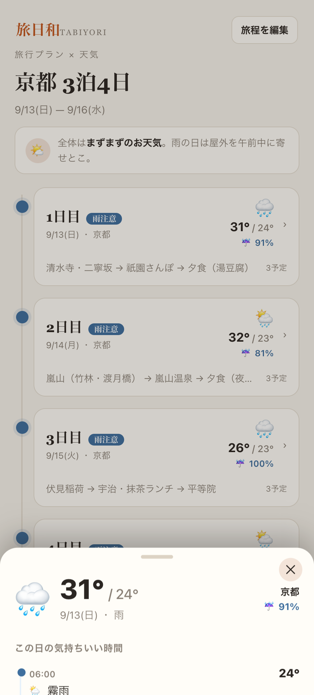
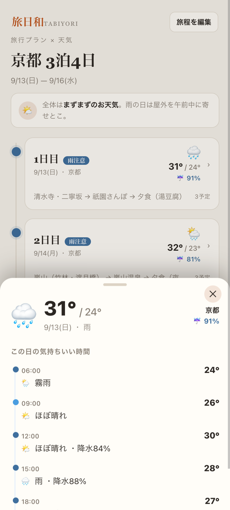

# 旅日和（tabiyori）

> 旅の予定日にぴったりの天気を、旅程に合わせて一覧できるWebアプリ。

「当日の現地の天気が気になる」「いつ何するか」に、最速で答えられるようにするための
**旅程 × 天気**のビュー。旅行前、空港で、ホテルで、スマホでサッと確認できるのがコンセプト。

---

## 特徴

- **メイン = 旅程タイムライン**：一日ごとの天気（アイコン・気温・降水率）と予定を一覧表示。
- **一日をタップ = 詳細シート**：大きな天気サマリー、時間別の天気、**「この日のポイント」**（傘・上着などのおすすめタグ）を下から表示。
- **天気は Open-Meteo**（APIキー不要・無料・世界対応・日別＋時間別）。
- **旅程の入力・編集**：行き先・日付・予定（時間＋タイトル）を設定可能。ブラウザに保存（localStorage）。




## 技術スタック

| 層 | 技術 |
|---|---|
| フレームワーク | Vite（ビルド/開発サーバー） |
| UI | バニラJS（フレームワークなし）+ 自前CSS |
| 天気API | [Open-Meteo](https://open-meteo.com/)（Geocoding + Forecast） |
| データ保存 | localStorage |
| デプロイ | GitHub Pages（想定） |

## データモデル

```jsonc
// localStorage: "tabiyori.trip"
{
  "name": "京都 3泊4日",
  "days": [
    {
      "date": "2026-10-22",        // YYYY-MM-DD
      "location": "京都",          // 場所名（geocoding で緯度経度に変換）
      "activities": [
        { "time": "11:00", "title": "清水寺・二寧坂" }
      ]
    }
  ]
}
```

## 天気まわり（src/weather.js）

- `geocode(name)`：場所名 → 緯度経度。Open-Meteo の geocoding は**都市名の完全一致**が必要
  （「京都」はヒットせず「京都市」はヒット）。入力名でダメなら「◯◯市」に付け替えて再試行する
  フォールバック入り。
- `fetchForecast(lat, lon, dates)`：日別（最高/最低気温・降水確率・天気コード）＋主要時間帯
  （6/9/12/15/18/21時）の時間別予報を取得。無料枠は最大16日先まで。
- `mapWeatherCode(code)`：WMO 天気コード → アイコン・日本語ラベル変換。
- `summarizeDay(wx)`：1日のサマリー（アイコン・気温・降水・雨フラグ）。
- `packingTips(wx)`：天気に応じた持ち物提案（傘・帽子・上着など）とコメント文。

> **注**：予報は奥16日まで。旅行当日が16日以上先の間は「予報範囲外」と表示され、
> 1週間前くらいから実データが出ます。

## 使い方

```bash
npm install
npm run dev      # 開発サーバー http://localhost:5173/tabiyori/
npm run build    # 本番ビルド → dist/
npm run preview  # ビルド結果をプレビュー
```

初回はサンプル旅程（京都・明日から4日）が自動で入ります。「旅程を編集」から行き先・日付・
予定を書き換えられます。

## デプロイ（GitHub Pages）

`vite.config.js` の `base` を GitHub Pages のパス（`/tabiyori/`）に合わせてある。

1. リポジトリを公開。
2. GitHub の Settings → Pages → Deploy from branch（or Actions）。
3. `npm run build` で `dist/` を生成し、`gh-pages` ブランチ（または Pages 向けのソース）に push。

## ディレクトリ構成

```
tabiyori/
├── index.html
├── package.json
├── vite.config.js        # GH Pages 用 base 設定
├── .gitignore
├── preview/              # スクリーンショット
└── src/
    ├── main.js           # UI・状態・融程編集・シート
    ├── weather.js        # Open-Meteo 連携・天気コード変換・持ち物提案
    └── style.css
```

## ロードマップ（今後のアイデア）

- 共有URLで旅程をシェア（URL に旅程を埋め込む/QR）
- 複数都市をまたぐ旅程
- 気温グラフ・週間予報の切り替え
- PWA化（オフラインでも最終取得データを表示）
